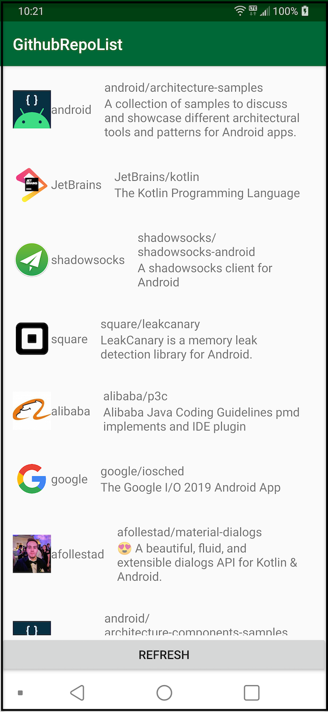

## GitHubRepoList is a simple app that connects to the GitHub API to retrieve and display a list of repositories

- Check network connection status
- Perform network operations
- Use open source libraries `Retrofit`, `Gson`, `Picasso`
- Use the modern approach to asynchronous programming in Android and Kotlin with coroutines

## Screenshots

